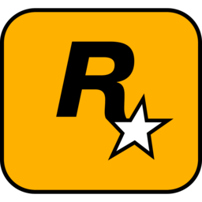

# Rockstar_Games_Launcher
Rockstar Games Launcher (forked from OldModz95-YTB)

## Why?
~~Because I can.~~ Joking. I came across this while searching "Rockstar Games" on the good ol' Hub. (GitHub I mean, not any other Hub...) and noticed the menu doesn't really look anything like the current launcher. The logo is different, the fonts aren't the same, some of the graphics on the forms are different, and I don't actually think this has any server-side functionality yet, so... Yay. Then again, the repo was only made 8 days ago, so... Meh?

### Plans
- Implement server functionality (not sure when I'll do this or if I'll even have enough time to lol)
- Translate it into English properly
- Add animations for the different windows
